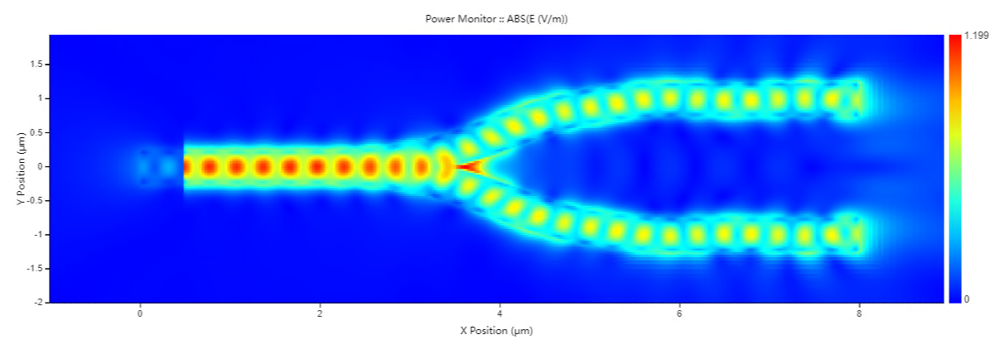
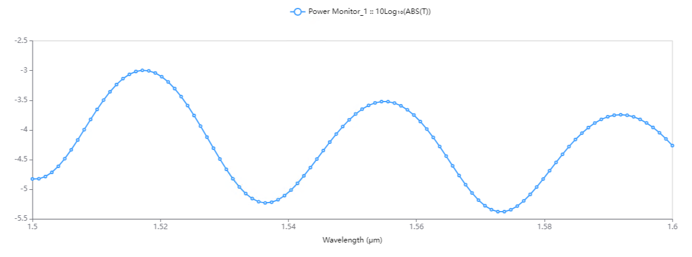
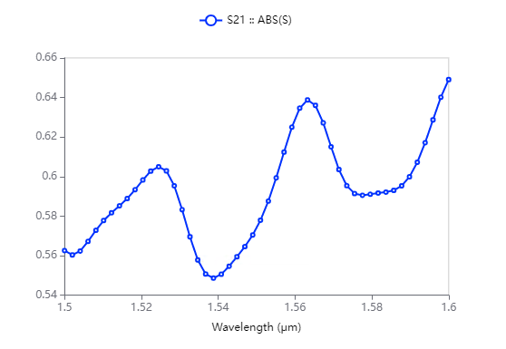

# Y branch 

The insertion loss, transmission and S-parameters of a Y-branch are calculated using FDTD Solver.

# Overview 

The  y  branch is simulated using the EME solver to measure the power transmission , insertion losss and the S-parameters .

## step 1 :Initial simulation
Ensure the simulation is setup properly and explore the results.

# run and results 

## measure Y beanch  performance 

## Field profile

## Insertion loss

## S-parameters sweep
### for s21 

